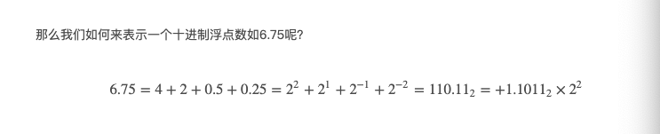
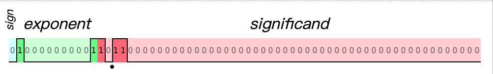
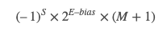

# 动态语言&静态语言

## 动态语言

* 在用户的设备/在线服务器上，如：JavaScript，Python
* 产品运行时
* Runtime

## 静态语言

* 在程序员开发环境上（C\C++)
* 产品开发时
* Compiletime

# 强类型 & 弱类型

## 强类型

数据类型不会进行默认转换，如： '1' == 1，代表有Java

## 弱类型

数据类型在操作时会默认转换，如： String + Number, String == Boolean，代表：JavaScript

# 命令式编程语言结构

## Atom(原子)

关键字、变量名、字符串直接量、数字直接量。

* Literal
* Variable
* Keywords
* Whitespace
* Line Terminator

## Expression(表达式)

表达式由一些Atom和操作符构成，如四则运算表达式：1+3*4

## Statement(语句)

表达式加上特定的标识符和符号组成特定的结构形成语句，如 if语句，for语句。

## Structure(结构化)

如Function\Class帮助组织或敷用代码的一些结构。

## Program

Program\Module\Package\Library等，在JavaScript中对应为NPM，Python中应该为PIP。

# Number

## IEEE 754 64位双精度浮点类型

JavaScript中的Number类型为双精度IEEE 754 64位浮点类型[双精度浮点类型](https://en.wikipedia.org/wiki/Floating-point_arithmetic)。 总体来说，IEEE754规定将十进制数字转为二进制的**科学计数法**后在64byte内存中的储存规则。下图表示了如何用二进制的科学记数法表示6.75。

### 二进制科学记数法



### IEEE 754存储规则



* 最高位为符号(sign)位，0为正，1为负。
* 绿色部分11位为指数偏移位= exponent+bias（等于上图6.75中的2+1023的二进制表示）, 其中bias = 2**N - 1 = 1023。至于为什么要有偏移，是因为exponent要表示正负，范围从[-1023, 1023]，即大于10000000000 的部分为正指数位，小于的为负指数。
* 有效数（significand）的小数部分M，为52位，默认省略了科学记数法的1(因为二进制科学技术法第一位有效位只能为1），根据以上公示，可以从存储格式中直接得出浮点数的十进制值：



## 相关疑问

### 能表示的最大数字是多少

最大为1.11111...(52) * 2 **1023即为：Number.max_value，但是Number.min_value表示JavaScript中最小的正数。

### 能确保精度的最大整数是多少（最大安全数字）

M部分表示精度的大小，因为M部分只有52byte(如果超过52位则会被四舍五入），所以能确保精度的最大整数为1.1111...(52) * 2 ** 52(=2**53 - 1)，即Number.MAX_SAFE_INTEGER。

### 0.1 + 0.2 !== 0.3

如上面介绍的JavaScript中Number存储机制，只有能被2的次幂相加得到的数能（如6.75 = 2 ** 2 + 2 ** 1 + 2 ** -1 + 2 ** -2 = 110.11 = 1.1011 * 2 ** 2）精确表示，那些不能用二进制精确表示的数，在（M部分）52位后会按照遇1进1，遇0 舍去的原则进行处理，导致精度缺失。所以再来看上式，0.1、0.2、0.3 均无法用二进制精确表示，故在53位进行了精度处理，所以最后这个语句共发生了三次精度缺失，分别是0.1、0.2 、0.3。

## 参考

[从计组课到前端深坑：IEEE 754双精度浮点数的那些事](https://jacelynfish.cn/2019/06/08/ieee-floating-point-number/)

[IEEE 745可视化工具](http://bartaz.github.io/ieee754-visualization/)

[浮点数的二进制表示](https://www.ruanyifeng.com/blog/2010/06/ieee_floating-point_representation.html)

[一个函数让你看懂 'Why 0.1+0.2!=0.3'](https://juejin.im/post/6844903789082705934#heading-5)

[深入理解IEEE754的64位双精度](https://www.boatsky.com/blog/26)

[0.30000000000000004](https://0.30000000000000004.com/)

[Number-MDN](https://developer.mozilla.org/zh-CN/docs/Web/JavaScript/Reference/Global_Objects/Number)

[Number.MAX_SAFE_INTEGER -MDN](https://developer.mozilla.org/zh-CN/docs/Web/JavaScript/Reference/Global_Objects/Number/MAX_SAFE_INTEGER)

[Number.MIN_VALUE-MDN](https://developer.mozilla.org/zh-CN/docs/Web/JavaScript/Reference/Global_Objects/Number/MIN_VALUE)

[Number.MAX_VALUE](https://developer.mozilla.org/zh-CN/docs/Web/JavaScript/Reference/Global_Objects/Number/MAX_VALUE)

# String

## JavaScript进制转换

### toString()方法

```javascript
let baseTenInt = 10
console.log(baseTenInt.toString(2)) // "1010"
```

### parseInt()方法

接受一个指定进制的字符串，输出相对应十进制数。

```javascript
console.log(parseInt('F',16)) // 15
```

## 将字符串进行UTF-8编码

```javascript
/**
 * 方法1
 * 通过charCodeAt()拿到字符的UTF-16码点,按照UTF-8的编码
 * 规则转换为相对应字节。
 */
function UTF8_Encoding(str) {
  let buffer = []
  for (let i of str) {
    let code = i.charCodeAt() // 获取字符UTF-16码点
    // 按照补码规则进行补码
    if (code>=0 && code<=0x7F) {
      buffer.push('0'+ code.toString(2))
    } else if (code > 0x7F && code <=0x7FF) {
      let by = code.toString(2).padStart(16, 0)
      buffer.push([['110'+by.slice(0,5)], ['10'+ by.slice(5)]])
    } else if (code>0x7FF && code<=0xFFFF) {
      let by = code.toString(2).padStart(16, 0)
      buffer.push([['1110'+ by.slice(0,4)],['10'+by.slice(4,10)],['10'+ by.slice(10)]])
    } else if (code>0xFFFF && code<=0x1FFFFF) {
      let by = code.toString(2).padStart(21, 0)
      buffer.push([['1110'+ by.slice(0,3)],['10'+by.slice(3,9)],['10'+ by.slice(9,15)],['10'+ by.slice(15,)]])
    } else if (code>0x1FFFFF && code<=0x3FFFFFF) {
      let by = code.toString(2).padStart(26, 0)
      buffer.push([['1110'+ by.slice(0,2)],['10'+by.slice(2,8)],['10'+ by.slice(8,14)],['10'+ by.slice(14,20)], ['10'+ by.slice(20)]])
    } else if (code>0x3FFFFFF && code<=0x7FFFFFFF) {
      let by = code.toString(2).padStart(31, 0)
      buffer.push([['1110'+ by.slice(0,1)],['10'+by.slice(1,7)],['10'+ by.slice(7,13)],['10'+ by.slice(13,19)], ['10'+ by.slice(19,25)], ['10'+ by.slice(25)]])
    } 
  }
  return buffer
}

/**
 * 方法2
 * 通过encodeURI()方法
 */
function UTF8_Encoding_URI(str) {
  let codeList = []
  for (let i of str) {
    let codes = encodeURI(i).slice(1).split('%')
    codeList.push(codes.map(item => parseInt(item, 16)))
  }
  return codeList
}
```

## 参考

[Object.prototype.toString()看英文版-mdn](https://developer.mozilla.org/en-US/docs/Web/JavaScript/Reference/Global_Objects/Object/toString)

[parseInt-mdn](https://developer.mozilla.org/zh-CN/docs/Web/JavaScript/Reference/Global_Objects/parseInt)

[String.prototype.charCodeAt()-mdn](https://developer.mozilla.org/en-US/docs/Web/JavaScript/Reference/Global_Objects/String/charCodeAt)

[encodeURI()-mdn](https://developer.mozilla.org/en-US/docs/Web/JavaScript/Reference/Global_Objects/encodeURI)

[通过JavaScript进行UTF-8编码(有文档备份)](https://segmentfault.com/a/1190000005794963)


